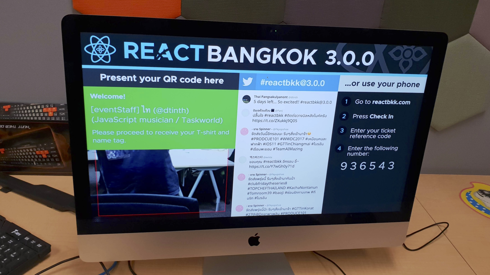
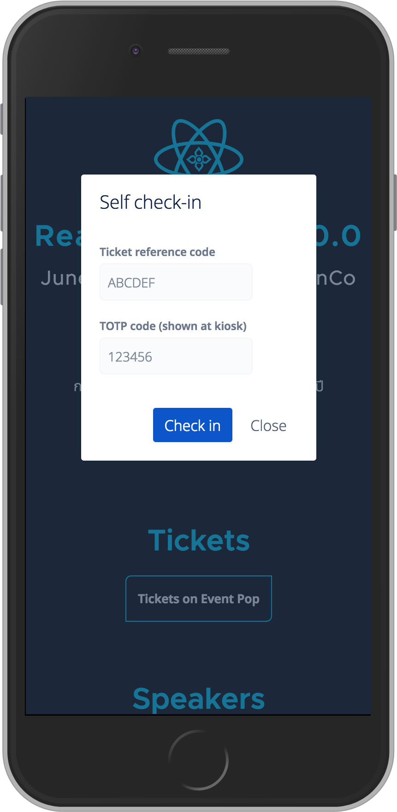
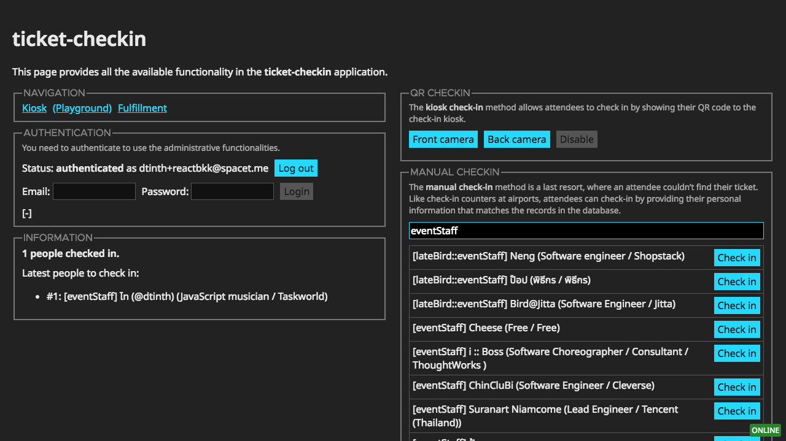
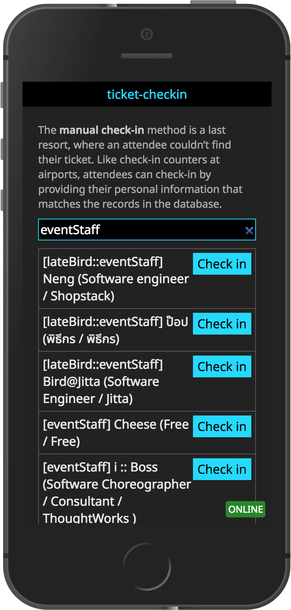
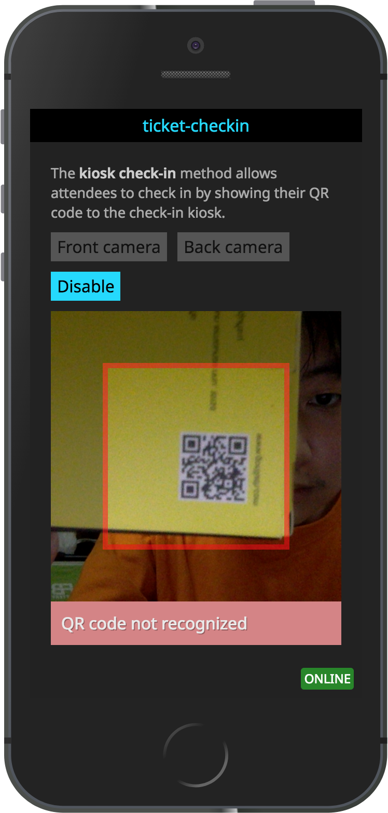

# ticket-checkin

Ticket check-in system, for events

## Screenshots tour

- **A check-in kiosk.** Attendee can present a QR code at the kiosk or use their mobile phone to self-checkin using their ticket reference number.

  

- **API for self-checkin.** Instead of presenting a QR code, an attendee can go to the event website and check in using their ticket reference number..

  

- **A staff panel.** Event staff can manually check-in tickets for the attendees.

  

  Mobile version:

  

- **QR code scanner webapp for event staff.** In addition to the kiosk, event staff can scan attendee’s QR code using their mobile phone.

  

## Features

- **Multiple check-in modes:**

  <table>
    <tr>
      <th>Check-in mode</th>
      <th>Pros</th>
      <th>Cons</th>
    </tr>
    <tr>
      <td>
        <strong>Self check-in</strong> 
        Attendee checks in by entering ticket refCode + time-based OTP.
      </td>
      <td>
        ◆ No need to wait in line. 
        ◆ Self-service. 
        ◆ Attendee gets a personal greeting.
      </td>
      <td>
        ◆ Unfamiliar method. 
        ◆ Requires attendee to have a mobile device to check in.
      </td>
    </tr>
    <tr>
      <td>
        <strong>Kiosk check-in</strong> 
        Attendee presents ticket QR code to check in at the kiosk.
      </td>
      <td>
        ◆ Works with printed tickets. 
        ◆ Self-service. 
        ◆ Attendee gets a personal greeting.
      </td>
      <td>
        ◆ Have to wait in line to use the kiosk.
      </td>
    </tr>
    <tr>
      <td>
        <strong>Staff check-in</strong> 
        Staff uses a mobile PWA to check attendees in using QR code.
      </td>
      <td>
        ◆ No need to wait in line. 
        ◆ Works with printed tickets.
      </td>
      <td>
        ◆ Needs manual work by staff. 
        ◆ Have to wait for an available staff. 
        ◆ Attendees don’t get a personal greeting.
      </td>
    </tr>
    <tr>
      <td>
        <strong>Manual check-in</strong> 
        A staff checks attendee in by searching manually. Used as a last resort.
      </td>
      <td>
        ◆ For when user has lost their ticket but can verify their identity.
      </td>
      <td>
        ◆ Needs manual work by staff. 
        ◆ Takes the most time.
      </td>
    </tr>
  </table>

- **Swag fulfillment:**

  - We printed high-quality name tags with attendees’ name ahead of time. After
    an attendee checks in, we want them to see their name tag already placed on
    the table.

  - When an attendee checks in, their information will be placed on a queue. A
    fulfillment staff will rotate to take orders from the queue. This is kinda
    like how Starbucks.

## Data model

Just read the [bolt](./database.rules.bolt) file.
